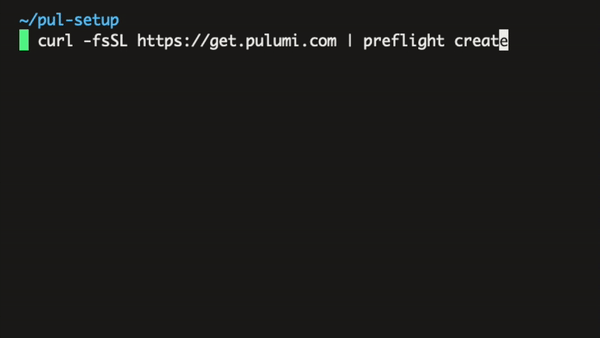

<p align="center">
<br/>
<br/>
<br/>
   
<br/>
<br/>
</p>
<p align="center">
<b>:bomb: Mitigate chain of supply attacks</b>
<br/>
<b>:ok_hand: Verify your curl scripts and executables</b>
<br/>
<hr/>
</p>

<p align="center">

<br/>

</p>

# :thinking: What is it?
`preflight` helps you verify scripts and executables to mitigate chain of supply attacks such as the recent [Codecov hack](https://spectralops.io/blog/credentials-risk-supply-chain-lessons-from-the-codecov-breach/).
# :gift: Getting Preflight

First of all, it's the chicken and the egg. How do you pull a legit `preflight` binary from us without verifying it with `preflight`? having that `preflight` is solving this exact problem?

The best way, is that you grab the source, compile it yourself, and use your own binary which you put in a place _that you trust_. People usually have several options of how to do that safely:

* Put it on your own S3 bucket
* Drop it on your own [Artifactory](https://jfrog.com/artifactory/) or similar
* Push it directly into your repos (it should be as small as 4mb, and almost never change so, Git should work nicely with it)
* Build from source into your containers directly:

```Dockerfile
FROM golang:1.16-alpine AS preflight_builder
RUN apk add --no-cache git
WORKDIR /builds
RUN GOBIN=`pwd` go get -u github.com/spectralops/preflight

# Build from a bare image, copy built binary
FROM alpine:3.9 
RUN apk add ca-certificates
COPY --from=preflight_builder /builds/preflight /usr/local/bin

# use preflight as you wish
RUN curl https://.. | preflight run <digest>
```


If you want to just get started quickly on your workstation, you can [download a release](https://github.com/spectralops/preflight/releases) or install `preflight` with homebrew:

```
$ brew tap spectralops/tap && brew install preflight
````


# :rocket: Quick Run


**Someone changed the script or binary you're running. Abort!**

```bash
$ curl -L https://XXX | preflight run sha256=1ce...2244a6e86
⌛️ Preflight starting
❌ Preflight failed:
Digest does not match.

Expected:
<...>

Actual: 
<...>
  
   Information:
   It is recommended to inspect the modified file contents.
```

**A hash is verified, but it is actually vulnerable. Abort!**

```bash
$ curl -L https://XXX | preflight run sha256=1ce...2244a6e86
⌛️ Preflight starting using file lookup: malshare.current.sha256.txt
❌ Preflight failed: Digest matches but marked as vulnerable.
   Digest matches but marked as vulnerable.

Information:
  Vulnerability: Hash was found in a vulnerable digest list
  More: malshare.current.sha256.txt
```

All ok, let's fly.

```bash
$ curl -L https://XXX | preflight run sha256=1ce...2244a6e86
⌛️ Preflight starting
✅ Preflight verified

... actual script output ...

```

# :sparkles:  Examples

## :octocat: Github action

You can install Preflight with a [Github action](https://github.com/marketplace/actions/setup-preflight), or use it like this:

```yaml
   - name: Setup Preflight
     uses: spectralops/setup-preflight@v1
```

And now, you have a `preflight` binary to play with.
## :golf: Running codecov safely in your CI

First, let's create a hash (before creating it, review the script manually and see that it's not doing anything funny):

```bash
$ curl -s https://codecov.io/bash | ./preflight create
sha256=d6aa3207c4908d123bd8af62ec0538e3f2b9f257c3de62fad4e29cd3b59b41d9
```

Now, we're going to take

```
sha256=d6aa3207c4908d123bd8af62ec0538e3f2b9f257c3de62fad4e29cd3b59b41d9
```

And use this to secure our pulls from Codecov. In this case, `preflight` is checked safely into your repo under `ci/preflight`.

----
BEFORE (insecure):


```yaml
steps:
   - curl -s https://codecov.io/bash | sh
```

AFTER (safe, yay!):

```yaml
steps:
   - curl -s https://codecov.io/bash | ./ci/preflight run sha256=d6aa3207c4908d123bd8af62ec0538e3f2b9f257c3de62fad4e29cd3b59b41d9
```

----

## :golf: Building Docker images in a secure way

It's recommended to use `preflight` when you're building Docker images, and are installing via `curl | sh` scripts that vendors give you.

Before:

```Dockerfile
FROM alpine:3.9 
RUN apk add ca-certificates
RUN apk add curl coreutils

RUN cd /opt && curl -L https://istio.io/downloadIstio | ISTIO_VERSION=1.7.2 sh
```

After (securely building preflight from source + validating Istio with preflight):

```Dockerfile
FROM golang:1.16-alpine AS preflight_builder

RUN apk add --no-cache git
WORKDIR /builds

RUN GOBIN=`pwd` go get -u github.com/spectralops/preflight

# Build from a bare image, copy built binary
FROM alpine:3.9 
RUN apk add ca-certificates
RUN apk add curl coreutils

COPY --from=preflight_builder /builds/preflight /usr/local/bin

# create a hash with:
# curl -L https://istio.io/downloadIstio | preflight create
RUN cd /opt && curl -L https://istio.io/downloadIstio | \
    ISTIO_VERSION=1.7.2 \
    preflight run sha256=e826fb57c6705cca0b6464edf4c1701d4bd5fd5879f5820fca78941c0a83ce64
```

Using `preflight` we're also getting a nice confirmation badge during the build process:


```
... docker build log...

⌛️ Preflight starting
✅ Preflight verified

Downloading istio-1.7.2 from https://github.com/istio/istio/releases/download/1.7.2/istio-1.7.2-linux-amd64.tar.gz ...

Istio 1.7.2 Download Complete!
```


## :bulb: Dealing with changing runnables & auto updates

When updating an old binary or script to a new updated version, there will be at least two (2) valid digests "live" and just replacing the single digest used will fail for the older runnable which may still be running somewhere.

```
$ preflight <hash list|https://url/to/hash-list>
```

To support updates and rolling/auto updates of scripts and binaries we basically need to validate against `<old hash>` + `<new hash>` at all times, until everyone upgrades to the new script. Preflight validates against a `list of hashes` or better, give it a _live_ URL of `valid hashes` and it will validate against it.


```
curl .. | ./ci/preflight run sha256=d6aa3207c4908d123bd8af62ec0538e3f2b9f257c3de62fad4e29cd3b59b41d9,sha256=<new hash>,...
```

Or to a live URL:
```
curl .. | ./ci/preflight run https://dl.example.com/hashes.txt
```


Use this when:

* Use multiple digests verbatim, when your runnables change often, but not too often
* Use a URL when your runnables change often. Remember to follow the chain of trust. This will now mean that:
  * Your hash list URL is now a source of trust
  * Visually: we're swapping the chain of trust like so `curl <foreign trust> | ./ci/preflight <own trust>`

## :running: Running scripts and binaries

**Piping:**

```bash
$ curl -s https://example.com/some-script | preflight run sha256=d6aa3207c4<...>b4
```

**Executables:**

```bash
$ preflight run sha256=d6aa3207c4<...>b4 ./my-script.sh
```
## :mag_right: Checking scripts and binaries

**Piping:**

```bash
$ curl -s https://example.com/some-script | preflight check sha256=d6aa3207c4<...>b4 | sh
```

Not that `preflight check` is built in a way that you could continue to pipe to the next process:

* If a check passes, the checked script or binary content will be dumped to `STDOUT`
* If a check fails, you'll get an `exit(1)`, and an error message

**Executables:**

```bash
$ preflight check sha256=d6aa3207c4<...>b4 ./my-script.sh
```

In this case:

* If a check passes, you'll get an `exit(0)` and no output (so you can compose with other tooling)
* If a check fails, you'll get an `exit(1)` and an error message


## :round_pushpin: Creating new hashes

You can easily create new hashes with `preflight`. The default is a SHA256 hash, but you could also create a `sha256`, `sha1`, and `md5` hash.


```bash
$ preflight create test.sh
sha256=fe6d02cf15642ff8d5f61cad6d636a62fd46a5e5a49c06733fece838f5fa9d85
```

Though not recommended, you can create other kinds (weaker kinds) of hashes for legacy/compatibility reasons:

```bash
$ preflight create test.sh --digest md5
md5=cb62874fea06458b2b0cabf2322c9d55
```

# :see_no_evil: Using optional malware lookup

`preflight` comes with lookup providers, which is optional -- you can enable them by using environment variables:

## File Lookup

You can download a daily list of malware signatures from [malshare.com]() or any equivalent service. Here is a [direct link to such a list](https://www.malshare.com/daily/malshare.current.sha256.txt).

Then:

* Set `PF_FILE_LOOKUP=./path/to/text/file`

With this configured `preflight` will search for all digest types in this file before approving.


Here is a full example for your CI, combining `preflight` with Malshare:

```
env:
   PF_FILE_LOOKUP: malshare.current.sha256.txt

steps: 
- wget https://www.malshare.com/daily/malshare.current.sha256.txt
- curl https://... | preflight <sha>
```

**Result:**

```
$ PF_FILE_LOOKUP=malshare.current.sha256.txt preflight run fe6d02cf15642ff8d5f61cad6d636a62fd46a5e5a49c06733fece838f5fa9d85 test.sh
⌛️ Preflight starting using file lookup: malshare.current.sha256.txt
❌ Preflight failed: Digest matches but marked as vulnerable.

Information:
  Vulnerability: Hash was found in a vulnerable digest list
  More: malshare.current.sha256.txt

```
## VirusTotal Lookup

You can use the [virus total community]() API access to lookup your hashes.


* Set `PF_VT_TOKEN=your-virustotal-api-key`

With this configured `preflight` will automatically create the VirusTotal lookup provider and validate digest with it.


Here is a full example for your CI, combining `preflight` with VirusTotal:

```
env:
   PF_VT_TOKEN: {{secrets.PF_VT_TOKEN}}

steps: 
- curl https://... | preflight <sha>
```


**Result:**

```
$ PF_VT_TOKEN=xxx preflight check e86d4eb1e888bd625389f2e50644be67a6bdbd77ff3bceaaf182d45860b88d80 kx-leecher.exe
⌛️ Preflight starting using VirusTotal
❌ Preflight failed: Digest matches but marked as vulnerable.

Information:
  Vulnerability: VirusTotal stats - malicious: 40, suspicious 0
  More: https://www.virustotal.com/gui/file/e86d4eb1e888bd625389f2e50644be67a6bdbd77ff3bceaaf182d45860b88d80/detection
```
## Other lookup types?

We've established that a _file lookup_ is universal and general enough to be useful to everyone. However, you might prefer your own vendor, or a service such as VirusTotal -- `preflight`'s architecture is pluggable and we're accepting [pull requests](https://github.com/spectralops/preflight).

# Thanks

To all [Contributors](https://github.com/spectralops/preflight/graphs/contributors) - you make this happen, thanks!


# Copyright

Copyright (c) 2021 [@jondot](http://twitter.com/jondot). See [LICENSE](LICENSE.txt) for further details.
